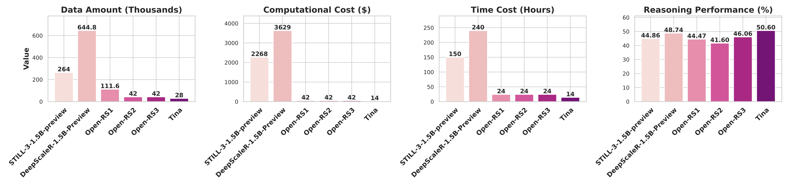
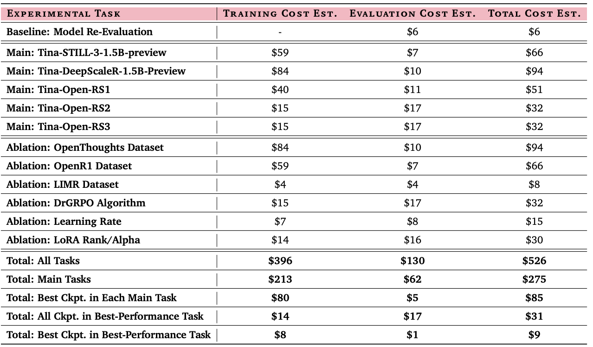
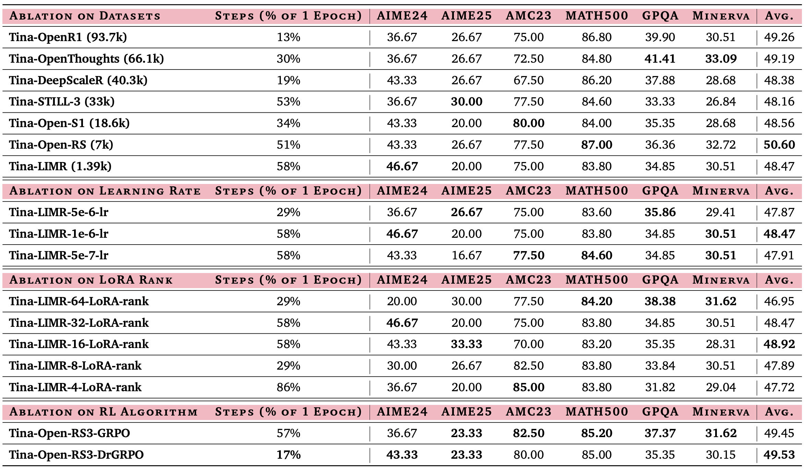
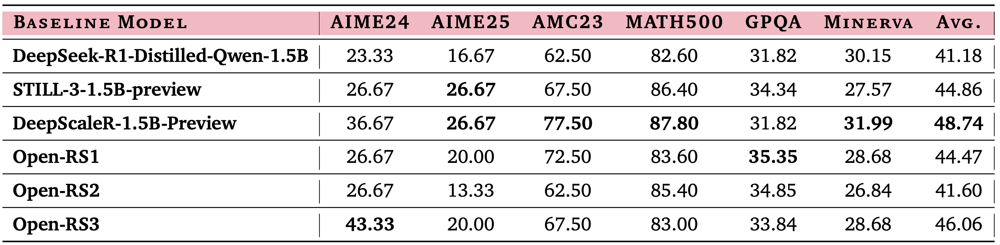
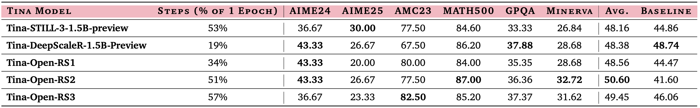

<div align="center">
  <h1 style="font-family: 'Segoe UI', Tahoma, Geneva, Verdana, sans-serif; margin-bottom: 10px;">
    Tina: Tiny Reasoning Models via LoRA
  </h1>

  <hr style="width: 60%; border: none; border-top: 2px solid #ccc; margin: 0 auto 20px auto;">

  <a href="https://github.com/shangshang-wang/Tina">
    
  </a>
</div>

<div align="center">

[](https://github.com/shangshang-wang/Tina)
[](https://shangshangwang.notion.site/tina) 
[](https://huggingface.co/Tina-Yi)
[](https://wandb.ai/upup-ashton-wang-usc/Tina)

</div>

## Overview

This repository contains the code for the Tina project, accompanying the paper [Tina: Tiny Reasoning Models via LoRA](https://arxiv.org/abs/2504.15777). 
We in this project try to answer the question "How cost-effectively can one perform reinforcement learning to efficiently instill reasoning abilities in language models?"
Specifically, we explore enhancing reasoning capabilities in tiny language models with low-rank adaptation during reinforcement learning.

<div style="text-align: center;">
   
    </div>

We show that our Tina models achieve performance competitive with, and in some cases even superior to, SOTA baseline models built on the same base model with full-parameter training.
In particular, the best Tina model achieves a >20% performance increase and 43.33% Pass@1 accuracy on AIME24. 
Notably, the cost of reproducing the best Tina checkpoint stands at only \$9, and of reproducing all our experiments from scratch at \$526.

<div style="text-align: center;">
  
    </div>


## Quick Start

### File Setup

* `./scripts/set/set_vars.sh`: contain the main env vars we use, change the path (marked with a TODO sign) to align with your own setting.
* `./recipes/DeepSeek-R1-Distill-Qwen-1.5B/grpo/`: contain the recipes for each experiment in this project, change the HF hub id (marked with a TODO sign) to align with your own setting.
* `./tina/config.py`: contain the main configurations for this project, set default values here.
* `./tina/utils/constant.py`: contain the main datasets for each experiment in this project.

### Env Setup

Run the following commands to install the dependencies.
```bash
conda create -n tina python=3.10 -y && conda activate tina
./scripts/set/set_env.sh && conda deactivate

conda create -n tina_eval python=3.10 -y && conda activate tina_eval
./scripts/set/set_env_eval.sh && conda deactivate

# download the pre-trained models to the `CKPT_DIR` directory.
conda activate tina && ./scripts/set/prepare.sh
```

### Training & Evaluation

* LoRA-based RL with GRPO: `conda activate tina && ./scripts/train/post_train_model_grpo.sh`

<div style="text-align: center;">
  
    </div>

After that, we have the following file structure in the `CKPT_DIR` directory.
```bash
CKPT_DIR/
│
├── models/
│   ├── DeepSeek-R1-Distill-Qwen-1.5B/
│   │   └── base/ # pre-trained models 
│   │   └── grpo_PT_DATASET_I/ # post-trained models via GRPO using PT_DATASET_I
│   │   │   └── checkpoint-i/ # we should keep checkpoints during post-training in a stepwise manner
│   │   │   └── ...
│   │   └── grpo_PT_DATASET_II/ # post-trained models via GRPO using PT_DATASET_II
│   │   │   └── checkpoint-i/
│   │   │   └── ...
│   │   └── ...
```

* Re-evaluate baseline models: `conda activate tina_eval && ./scripts/eval/eval_baselines.sh`

<div style="text-align: center;">
  
    </div>

* Evaluate post-trained models: `conda activate tina_eval && ./scripts/eval/eval_post_train.sh`

<div style="text-align: center;">
  
    </div>

## Acknowledgements

We thank Huggingface to open source the amazing [open-r1](https://github.com/huggingface/open-r1/tree/7041fbc9d65b6f1832db727961e8282243f8f82a) project, which is the starting codebase of our Tina project. 
We also appreciate all researchers releasing their open-source reasoning datasets, including [open-r1/OpenR1-Math-220k](https://huggingface.co/datasets/open-r1/OpenR1-Math-220k), [bethgelab/CuratedThoughts](https://huggingface.co/datasets/bethgelab/CuratedThoughts), [agentica-org/DeepScaleR-Preview-Dataset](https://huggingface.co/datasets/agentica-org/DeepScaleR-Preview-Dataset), [RUC-AIBOX/STILL-3-Preview-RL-Data](https://huggingface.co/datasets/RUC-AIBOX/STILL-3-Preview-RL-Data), [knoveleng/open-rs](https://huggingface.co/datasets/knoveleng/open-rs), [knoveleng/open-s1](https://huggingface.co/datasets/knoveleng/open-s1), and [GAIR/LIMR](https://huggingface.co/datasets/GAIR/LIMR), which are used for our training.

*Tina's avatar is generated by GPT-4o based on [KYNE](https://www.artsy.net/artist/kyne)'s girls and the following prompt.*

*Hi, I’m Tina — an INTJ who’s all about getting to the essence of things. I study reasoning models because I’m fascinated by how structured thinking and logic can emerge from data. Outside of that, I recharge with movies, music, and the occasional gaming session. I believe in strategic effort: minimal input, maximum impact — whether it’s in research or everyday life, I’m always looking for the most efficient path to meaningful results.*

## Citation

```cite
@misc{wang2025tinatinyreasoningmodels,
      title={Tina: Tiny Reasoning Models via LoRA}, 
      author={Shangshang Wang and Julian Asilis and Ömer Faruk Akgül and Enes Burak Bilgin and Ollie Liu and Willie Neiswanger},
      year={2025},
      eprint={2504.15777},
      archivePrefix={arXiv},
      primaryClass={cs.CL},
      url={https://arxiv.org/abs/2504.15777}, 
}
```
